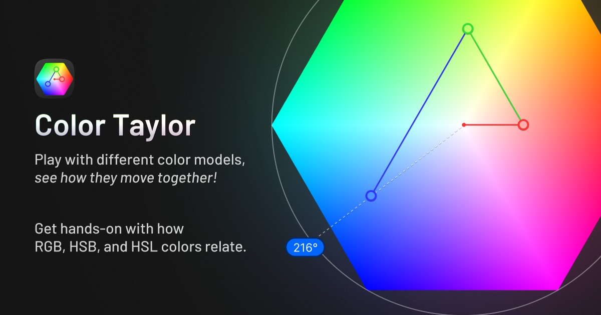

# Color Taylor 🎨🧵



A color picker built to show how RGB and HSB/HSL describe the same color. Drag one channel and the other two move in response. Pull saturation down and watch three RGB values converge. It is about the relationship between the models more than the swatch you walk away with.

**Web app:** https://redlamp.github.io/color-taylor/
**Figma plugin:** https://www.figma.com/community/plugin/1671457712575610716/color-taylor

## What it does

The picker is a hexagon with red, yellow, green, cyan, blue and magenta at the corners and white in the middle. Every color sits somewhere inside it. Around it are a saturation/brightness box, a hue strip, sliders for RGB, HSB, HSL and alpha, a hex field, a named-color matcher, and the equations used to convert between models. Recent and saved swatches persist in `localStorage`, and each drag is its own undo step.

There is also a color synth that maps the current color to sound: hue to pitch, or RGB to a three-voice chord, with configurable tuning, waveform and ADSR. It ships switched off. Turn it on in Settings; nothing audio-related loads until you do.

A narrated slideshow about color history sits behind the `VITE_INTRO_ENABLED` build flag. The deploy does not set it, so the Intro button and the `#/presentation` route are not on the live site. Run `VITE_INTRO_ENABLED=true bun dev` if you want to see it.

## Figma plugin

`figma/` is a Figma plugin that renders the app's real `ColorHexagon` rather than a copy of it, so the two surfaces cannot drift apart. Select a layer, pick a color, and the fill or stroke updates as you drag. It makes no network requests, which the manifest declares.

`bun run build:figma` writes `figma/ui.html`, a generated bundle that is gitignored. Run it once after cloning.

## Tech stack

- TypeScript, with `strict: false` for now (see [#16](https://github.com/redlamp/color-taylor/issues/16))
- React 19
- Vite 8, rolldown bundler
- Tailwind v4 through `@tailwindcss/vite`
- shadcn, style `base-nova`, neutral base, CSS variables
- base-ui primitives
- bun as package manager and script runner

## Quick start

```sh
bun install
bun dev          # localhost:5173
```

## Commands

| Command | What it does |
|---|---|
| `bun install` | Install deps from `bun.lock` |
| `bun dev` | Vite dev server with HMR |
| `bun run build` | Production build to `dist/` |
| `bun run preview` | Serve the last build locally |
| `bun run test` | Playwright e2e. Starts its own dev server, or reuses one already on :5173 |
| `bun run lint` | ESLint flat config |
| `bun run typecheck` | `tsc --noEmit`, plus the plugin's own tsconfig |
| `bun run build:figma` | Build the plugin UI bundle |
| `bun run preview:card` | Check the link-preview tags on a build and open a mock of the card |
| `bun run deploy` | Build and publish to `gh-pages` by hand, skipping the tests CI would run |
| `bun run deploy:dev` | Publish the current branch to `gh-pages/dev/` for preview at `redlamp.github.io/color-taylor/dev/` |

## Branch workflow

```
main <- dev <- feature/*
```

Branch off `dev`, open a PR into `dev`, merge with `--no-ff`. Promote `dev` to `main` through a PR when it is ready to ship.

Pushing to `main` runs the tests and then publishes `dist/` to `gh-pages` automatically, so the deploy cannot outrun a failure. `gh-pages` is a build artifact. Never edit it directly.

Work is tracked as [GitHub Issues](https://github.com/redlamp/color-taylor/issues). PRs close them with `Closes #N`.

## Architecture notes

Two top-level views, routed by URL hash:

- `#/` is the color picker
- `#/presentation/N` is the lazy-loaded slideshow, when the flag is on

The deeper notes live in [`CLAUDE.md`](./CLAUDE.md): the color math conventions, the HSB-canonical state with its RGB override ref, the hand-rolled rAF tweens, and how undo/redo works. Decisions and their reasoning are in [`wiki/`](./wiki), an Obsidian vault, starting at [`wiki/index.md`](./wiki/index.md).

## License

Personal project, no license file. Assume all rights reserved unless noted otherwise.
